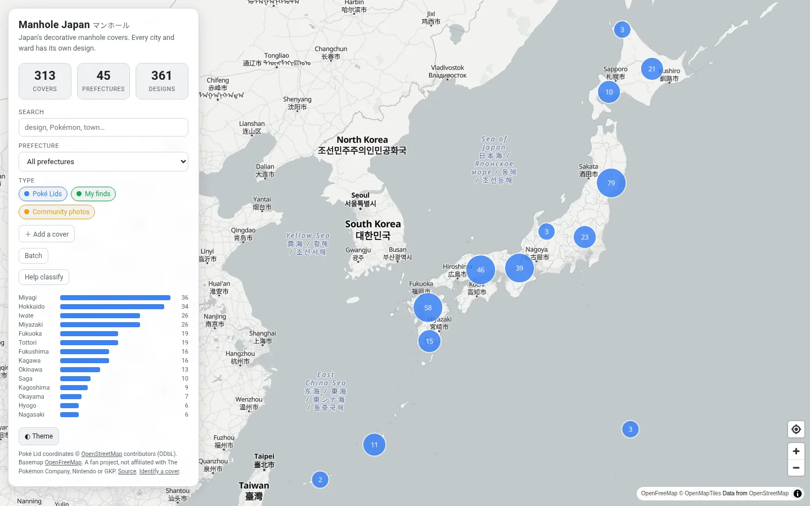

# Manhole Japan

An interactive map of Japan's decorative manhole covers. In Japan almost every
city and ward casts its own design — flowers, castles, festivals, local legends,
Pokémon — and this map plots where they are.

**[Live demo](https://sofianebeloucif.github.io/manhole-japan/)**

<!--  -->

## What it does

- Clustered map of ~260 **Poké Lids** (ポケふた) across 27 prefectures, sourced
  from OpenStreetMap.
- Filter by prefecture, type, and free-text search (design, town, Pokémon).
- A stats panel and a per-prefecture bar chart that follow the current filter.
- Click a cover for its photo, Japanese name, themes and source link.
- Light / dark basemap, and a shareable URL (`?pref=Miyagi&q=Lapras&id=…`).
- Add your own finds via a small JSON file — no build tooling required.

## Stack

Static site, no backend. [MapLibre GL JS](https://maplibre.org/) with keyless
[OpenFreeMap](https://openfreemap.org/) vector tiles, vanilla ES modules, data
as GeoJSON. A small Python pipeline builds the dataset. Deployed to GitHub Pages
by Actions.

```
src/            vanilla JS modules (map, filters, stats, panel, url state)
data/
  covers.geojson      generated — the map reads this
  prefectures.geojson  simplified boundaries (for the prefecture filter)
  personal/*.json      hand-added observations, merged at build time
  sources/*.json       raw pulls, committed for reproducible builds
scripts/
  fetch_pokefuta.py   Overpass query -> data/sources/pokefuta_osm.json
  build_covers.py     normalise + assign prefecture + dedupe -> data/covers.geojson
  validate.py         CI gate (schema + photo checks)
  optimize_images.py  raw photos -> WebP
  smoke.mjs           headless jsdom wiring test
```

## Develop

```bash
npm install
npm run data       # fetch + build + validate the dataset
npm run serve      # http://localhost:8777
npm run lint
npm run smoke      # headless functional test
```

## Add a cover you've seen

1. Put a photo at `assets/photos/_raw/<slug>.jpg` and run `npm run images`.
2. Add an entry to `data/personal/mine.json` (copy `data/personal/_template.json`):
   coordinates `[lon, lat]`, `name_en`, `municipality`, `themes`, and
   `photo: "assets/photos/<slug>.webp"` / `photo_thumb: "…thumb.webp"`.
   Leave `prefecture_en` null — it's filled in from the coordinates.
3. `npm run data` then `npm run lint` — open a PR.

## Add a cover from the site

Open **＋ Add a cover** (top of the panel) or the **Identify a cover** link in the
footer. Pick a JPEG/PNG of a cover: the page reads its EXIF GPS, can OCR the text
cast into it, and (once enough photos exist) runs a prefecture classifier, then
gives you a ready-to-paste JSON block, two optimised WebP files, and the steps to
open a pull request. Everything runs in your browser — the photo is never
uploaded, and its GPS metadata is stripped from the files you download.

### Origin recognition

`src/recognize/analyze()` combines three independent signals:

| Signal | How | Notes |
| --- | --- | --- |
| GPS | EXIF coordinates → prefecture (point-in-polygon) + nearest known cover | strongest; needs a geotagged photo |
| OCR | Tesseract.js (Japanese) reads the cast text → matched against `data/municipalities.json` | best-effort on stylised metal |
| Classifier | `mobilenet_v3_small` fine-tuned on contributed photos, run via ONNX in the browser | shows "not enough data yet" until ~50 labelled photos exist, then trains automatically (`train-model.yml`) |

`data/municipalities.json` is built by `scripts/build_gazetteer.py` from
[geolonia/japanese-addresses](https://github.com/geolonia/japanese-addresses)
(licence noted there).

Appending `?tool=identify` to the URL opens the same engine as a standalone tool —
drop a photo, read the three signal cards and the verdict, then hand off to the
pre-filled contribution form.

## Data & attribution

| Data | Source | Licence |
| --- | --- | --- |
| Poké Lid locations | [OpenStreetMap](https://www.openstreetmap.org/copyright) via Overpass | ODbL 1.0 |
| Prefecture boundaries | [dataofjapan/land](https://github.com/dataofjapan/land) | as upstream |
| Basemap | [OpenFreeMap](https://openfreemap.org/) / OpenStreetMap | ODbL 1.0 |
| Personal observations & photos | Sofiane Beloucif | see `PHOTO_CREDITS.md` |

Photos in this repo are the author's own work or Creative Commons / public
domain, credited per entry. The code is MIT (`LICENSE`); generated data files
derived from OpenStreetMap remain under ODbL.

This is a fan project. It is **not affiliated with** The Pokémon Company,
Nintendo, or the GKP / Japan Sewage Works Association.

## Roadmap

- **v2** — GKP manhole-card dataset (scraper + ~1000 more covers), list/grid
  view, prefecture choropleth.
- **v3** — personal "visited / card collected" layer (localStorage), OSM
  enrichment, `flake.nix` dev shell, FR/JA UI.
